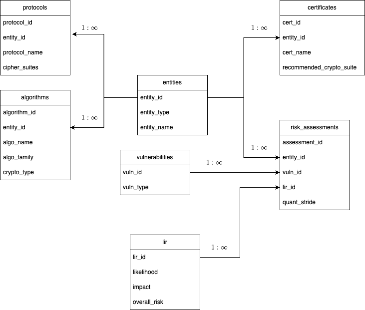

<p align="center">
  
</p>

QuantGPT is an agentic AI framework that incorporates knowledge-graph reasoning with cryptographic vulnerability scanning through large language models (LLMs) to identify potential post-quantum security threats from a system technical design document. Its main use is to help automate risk analysis reports.

>Developed by Dr. Aaron Crighton, Dr. David Jaramillo-Martinez, Tonatiuh Matos-Wiederhold, and Dr. Ethan Ross
>as Visiting Scholars at the **Fields Institute for Research in Mathematical Sciences**, in partnership with **Scotiabank**.

## Features

- Agentic AI architecture with autonomous task orchestration
- Knowledge-graph core for scalable reasoning and contextual memory
- Cryptographic quantum vulnerability scanner powered by AI-assisted analysis
- Configurable OpenAI integration with support for multiple models and tuning profiles
- Modular, extensible design for research and enterprise deployments

## Knowledge graph

<p align="center">
  
</p>

## Setup

1. Clone the repository

```bash
git clone https://github.com/<your-org>/QuantGPT.git
cd QuantGPT
```

2. Install dependencies

```bash
python3 -m venv .venv
source .venv/bin/activate
pip install -r requirements.txt
```

3. Install in editable mode

This ensures the `quantgpt` command is available in your shell:

```bash
pip install -e .
```

4. Configure environment variables

Copy the example file and fill in your real secrets:
```bash
cp .env.example .env
```
Open `.env` and set at least your OpenAI API key:

```
OPENAI_API_KEY=sk-xxxxxx
```

5. Configure runtime settings

Copy the example config file:

```bash
cp config.example.yaml config.yaml
```
Edit `config.yaml` to choose your preferred OpenAI model, tuning parameters, and graph backends.

Defaults use the profile fast-local.

You can define your own profiles for high-accuracy or low-latency runs.

6. Run QuantGPT

```bash
quantgpt -f examples/cisco_convergeone.pdf --debug (optional)
```

This will process the specified PDF file inside the `technical_design_docs/` folder and produce a risk report inside `risk_reports`.

## Semantic Kernel Orchestrator

QuantGPT includes an advanced orchestrator built with Microsoft's Semantic Kernel framework that provides autonomous task orchestration and function calling capabilities.

### Features

- **Autonomous Orchestration**: Uses Semantic Kernel's function calling to automatically coordinate PDF analysis workflows
- **Plugin Architecture**: Modular plugins for PDF analysis, risk assessment, and orchestration
- **Multiple Execution Modes**: Support for planner, agent, and direct execution modes
- **OpenRouter Integration**: Built-in support for OpenRouter API with fallback to OpenAI

### Usage

The orchestrator can be run directly from the `src/quantgpt/` directory:

```bash
cd src/quantgpt
source ../../venv/bin/activate
export OPENROUTER_API_KEY="your-openrouter-key"
python3 quantgpt_orchestration.py -f path/to/document.pdf --mode direct
```

**Note**: The orchestrator requires specific versions of semantic-kernel and pydantic for compatibility. The requirements.txt file includes the tested compatible versions.

### Execution Modes

- **`--mode direct`**: Direct kernel function invocation (recommended)
- **`--mode agent`**: Uses Semantic Kernel agent with function calling
- **`--mode planner`**: Autonomous planning (requires newer Semantic Kernel version)

### Output

The orchestrator generates comprehensive risk assessment reports in the `risk_reports/` directory at the project root level, including:

- Component extraction and analysis
- Knowledge graph mapping
- Quantum vulnerability assessments
- STRIDE threat model analysis
- Detailed risk scoring (LIR - Likelihood, Impact, Risk)

## Security Best Practices

Never commit your `.env` or `config.yaml` (they are already in `.gitignore`).

If using GitHub Actions, add OPENAI_API_KEY as a repository secret and load it using env: in your workflows.

**Rotate keys immediately if leaked.**
