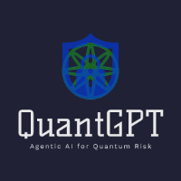

<p align="center">
  
</p>

QuantGPT is an advanced agentic AI framework that fuses knowledge-graph reasoning with cryptographic vulnerability scanning to identify potential quantum-era threats.

It leverages cutting-edge large language models, structured data pipelines, and graph analytics to deliver state-of-the-art security insights.

>Developed by Dr. Aaron Crighton, Dr. David Jaramillo Martinez, Tona, and Dr. Ethan Ross
>as Visiting Scholars at the **Fields Institute** for Research in Mathematical Sciences, in strategic collaboration with **Scotiabank**.

## Features
- Agentic AI architecture with autonomous task orchestration
- Knowledge-graph core for scalable reasoning and contextual memory
- Cryptographic quantum vulnerability scanner powered by AI-assisted analysis
- Configurable OpenAI integration with support for multiple models and tuning profiles
- Modular, extensible design for research and enterprise deployments

## Setup
1. Clone the repository

```bash
git clone https://github.com/<your-org>/QuantGPT.git
cd QuantGPT
```
2. Install dependencies

```bash
python3 -m venv .venv
source .venv/bin/activate
pip install -e .[dev]
```
3. Configure environment variables

Copy the example file and fill in your real secrets:
```bash
cp .env.example .env
```
Open `.env` and set at least your OpenAI API key:

```
OPENAI_API_KEY=sk-xxxxxx
```
4. Configure runtime settings

Copy the example config file:

```bash
cp config.example.yaml config.yaml
```
Edit `config.yaml` to choose your preferred OpenAI model, tuning parameters, and graph backends.

Defaults use the profile fast-local.

You can define your own profiles for high-accuracy or low-latency runs.

5. Run QuantGPT

```bash
python -m quantgpt
```

## Security Best Practices

Never commit your `.env` or `config.yaml` (they are already in `.gitignore`).

If using GitHub Actions, add OPENAI_API_KEY as a repository secret and load it using env: in your workflows.

**Rotate keys immediately if leaked.**
